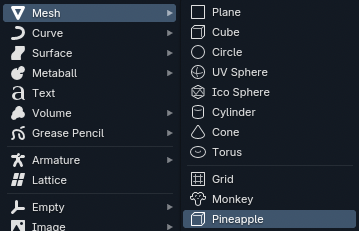
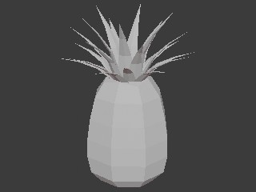

# Useless pineapple primitive

Blender addon / extension practice.  
I have no idea why you would need this.  
An alternative to suzanne, perhaps?

## Building
To build, add a folder named "build" and run build_pineapple.sh or build_pineapple.bat

##
I am in no way affiliated with Blender or the Blender Foundation, nor is this addon.  
If someone affiliated with Blender, the Blender Foundation, etc. happens to come across this addon and should they find any infringement on their trademark in this repository, please contact me and I will change whatever is necessessary.